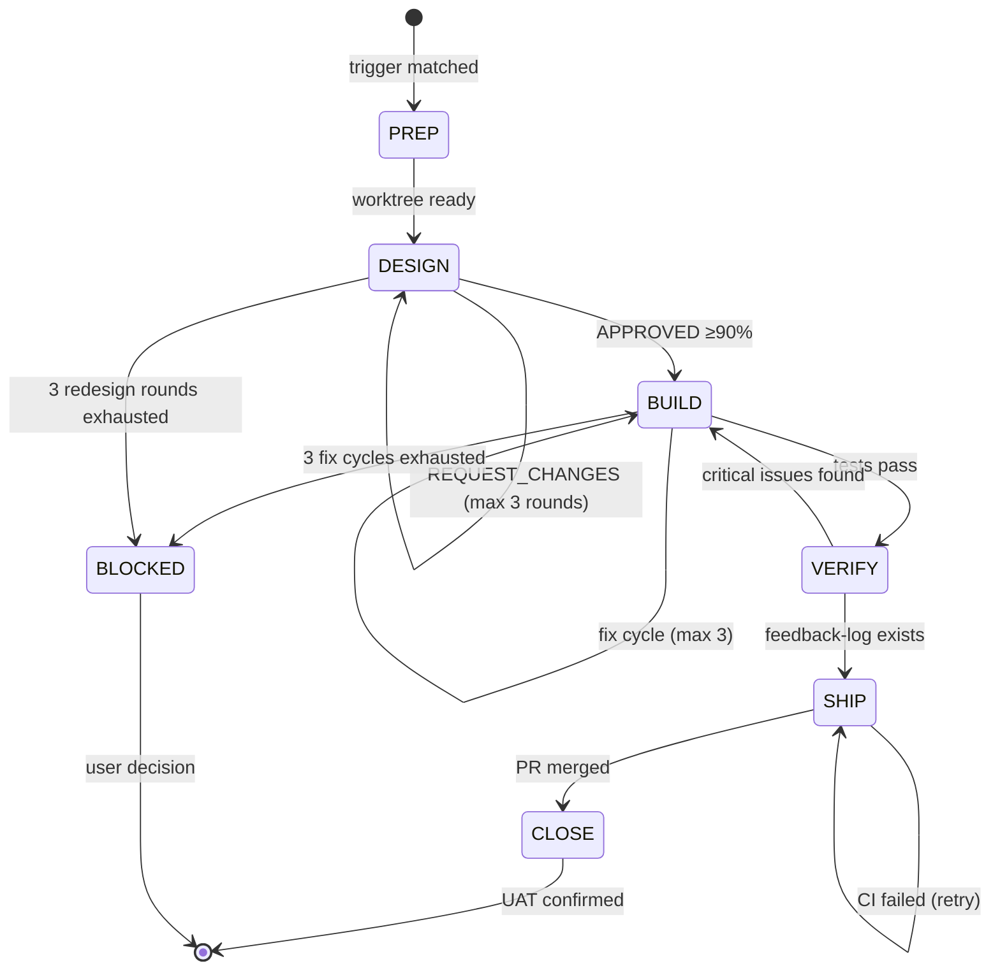

# Sprint Flow — 6-Phase Development Pipeline

## Triggers

| Trigger Type | Phrases |
|--------------|---------|
| **中文** | "开发新功能", "一键开发", "/sprint-flow", "开发用户登录", "创建 XXX 模块" |
| **English** | "/sprint-flow", "start sprint", "implement feature", "one-shot development", "build a feature" |

**Usage**: `/sprint-flow "[feature description]"`

**Examples**:
- `/sprint-flow "开发访谈机器人，支持多轮对话"`
- `/sprint-flow "实现用户认证模块，支持 OAuth2"`
- `/sprint-flow "开发 REST API 端点"`

**Optional Parameters**:
- `--no-isolate`: Skip auto worktree isolation (⚠️ risk of polluting protected branches)
- `--branch-name <name>`: Custom branch name (default: `sprint/YYYY-MM-DD-NN`)
- `--force`: Force continue on current branch even if protected (⚠️ requires explicit confirmation)
- `--stop-at <phase>`: Stop after specified phase (prep/design/build/verify/ship/close)
- `--resume-from <phase>`: Resume from specified phase
- `--phase <phase>`: Execute only single phase (prep-only/design-only/build-only/verify-only/ship-only/close-only)
- `--lang <language>`: Specify project language (springboot/django/golang)
- `--type <project_type>`: Specify project type (web-nextjs/web-react/web-vue/backend-go/backend-django/backend-springboot)
- `--spec <file>`: Use existing specification.yaml file
- `--with-performance`: Enable load/stress testing (backend projects)
- `--mode <build_mode>`: Phase 3 BUILD build mode. Default = ralph-loop. parallel = legacy all-at-once mode
- `--status`: View Sprint progress dashboard (read-only, no execution)

## Security Notes

- Sprint flow **does NOT execute destructive commands** (no `rm -rf`, `git push --force`, `DROP TABLE`, etc.)
- `git worktree remove` only deletes temporary worktree directories created by the sprint, never affects the main repo
- Phase 5 SHIP only creates PRs (`gh pr create`), never auto-merges without explicit user confirmation
- Sprint flow does not download, install, or execute external binaries

## Permissions

- `git`: read/write (worktree, branch, commit)
- `gh` (GitHub CLI): read/write (PR create, merge, CI query)
- `filesystem`: read/write (project dir + `.worktrees/` only)
- `network`: read-only (CI status, canary health)

---

## 6-Phase Pipeline

```
PREP → DESIGN → BUILD → VERIFY → SHIP → CLOSE
```

| Phase | Name | Key Actions | Output |
|-------|------|-------------|--------|
| 1/6 | PREP | Detect protected branch → Create git worktree → AUTO-ESTIMATE sizing → Classify (lightweight/standard/complex) | Worktree path + impact assessment |
| 2/6 | DESIGN | CONTEXT.md 预检 (#322) → grill-with-docs → R1 需求评审 → 设计文档+APPROVAL (HARD-GATE) → batch-grill-me → R2 delphi-review (≥90% consensus) → to-issues → specification.yaml | specification.yaml + slices-manifest.json + requirements-reviewed.json |
| 3/6 | BUILD | BUILD-ENTRY-CONTRACT → GITHOOKS-GATE → DELPHI-GATE → ralph-loop (default) or parallel → TDD → blind-review (read-only subagent) → verification | MVP code |
| 4/6 | VERIFY | delphi-review --mode code-walkthrough → test-specification-alignment (#367 HARD-GATE) → xp-gate check --all → browser (Layer 4) → learnings + xp-gate retro | Review report + feedback-log.md + test-alignment-report.json |
| 5/6 | SHIP | VERSION-GATE → 分支完成决策 (4选项) → native ship (create PR) → native land (merge + CI + canary) | PR URL + deploy status + merge confirmation |
| 6/6 | CLOSE | SHIP→CLOSE GATE (merge verified) → Backup sprint-state → #369 返工指标 → USER ACCEPTANCE (⚠️ mandatory manual) → Capture emergent issues → Cleanup worktree + branch | Emergent issues list + cleanup report + metrics |

**Hard Gates**:
- **DESIGN → BUILD**: R1 需求评审 APPROVED + 设计文档用户 APPROVED + R2 delphi-review APPROVED (≥90% consensus) + GITHOOKS-GATE + DELPHI-GATE + BUILD-ENTRY-CONTRACT (manifest schema + slice↔REQ)
- **VERIFY → SHIP**: feedback-log.md must exist + test-alignment-report.json PASS (#367 程序化 HARD-GATE)
- **SHIP → CLOSE**: PR must be merged to main + release completed (HARD-GATE)

---

## ⚠️ Required Output Format (MANDATORY for L3 Step Adherence)

Every phase MUST output its header as the first line of that phase's output. Format MUST be exact:

```markdown
## Phase 1/6: PREP (准备工作)
## Phase 2/6: DESIGN (设计)
## Phase 3/6: BUILD (构建)
## Phase 4/6: VERIFY (验证)
## Phase 5/6: SHIP (发布)
## Phase 6/6: CLOSE (收尾)
```

**Rules**:
1. First line of every phase output MUST be `## Phase X/6: NAME (中文名)`
2. NEVER omit "Phase" keyword (not "## 1/6" or "PREP" alone)
3. NEVER merge phase output — each phase gets its own header
4. On `/sprint-flow` trigger, first line MUST output: `Sprint Flow: PREP → DESIGN → BUILD → VERIFY → SHIP → CLOSE`
5. Each phase completion MUST write Phase Summary to `.sprint-state/phase-outputs/phase-{N}-summary.md`

### Phase Transition — TodoWrite Embedded (MANDATORY, resolves #366)

6. **Sprint initialization**: Phase 1 PREP MUST begin with `npx xp-gate sprint-init "<task_description>"` — this is the single entry point for sprint creation. NEVER manually write sprint-state.json.

7. **Phase transitions are embedded in TodoWrite items**, not as separate post-actions. Each phase's TodoWrite item MUST include the phase-transition call as part of the same atomic step:

   ```
   TodoWrite item format:
   - "Phase N: <main task> + phase-transition N completed → N+1 in_progress --render"
   ```

   Example TodoWrite items for a sprint:
   ```
   - Phase 1: PREP — estimate + sprint-init + phase-transition 1 completed --render
   - Phase 2: DESIGN — delphi review + phase-transition 2 completed --render
   - Phase 3: BUILD — implementation + phase-transition 3 completed --render
   ```

   **Rationale**: TodoWrite items are the LLM's most consistently executed operations. Embedding phase-transition elevates it from "post-action meta-info" (priority 4, ignored) to "main task step" (priority 2, executed).

8. **NEVER** manually write to `sprint-state.json` or manually render the dashboard. ALWAYS use:
   ```
   npx xp-gate phase-transition <phase> <status> --render [--outputs '<json>']
   ```
   - `<phase>`: 1-6
   - `<status>`: `in_progress` | `completed` | `skipped` | `failed` | `paused`
   - `--render`: Auto-renders ASCII progress dashboard after state update
   - `--outputs '<json>'`: Optional JSON of phase outputs to record

   This is a **HARD GATE** — the CLI is the single source of truth for state transitions and dashboard rendering.

### Phase Output Status Schema (MANDATORY per phase)

Each phase MUST close with structured status:

```
status: completed | blocked | user_decision_required
outputs: [list of files produced]
decisions: [list of decisions made]
next_phase_context: [key info for next phase]
```

---

## Phase 1/6: PREP (准备工作)

**触发条件**：用户输入匹配 Triggers 表中任一短语，或显式调用 `/sprint-flow`。

**输入**：
| 输入 | 来源 | 必需 |
|------|------|------|
| 功能描述 | 用户命令参数 | 是 |
| 当前分支 | `git branch --show-current` | 自动检测 |
| 项目语言 | `--lang` 参数或自动检测 | 否 |

**步骤**：
1. 输出首行：`Sprint Flow: PREP → DESIGN → BUILD → VERIFY → SHIP → CLOSE`
2. 检测当前分支是否为保护分支（main/master/develop）
3. 创建 git worktree 隔离（除非 `--no-isolate`）：
   ```bash
   git worktree add .worktrees/sprint-$(date +%Y%m%d-%H%M%S) -b sprint/YYYY-MM-DD-NN
   ```
4. AUTO-ESTIMATE 规模评估（分析功能描述复杂度）
5. 分类：lightweight / standard / complex
6. 执行 `npx xp-gate sprint-init "<task_description>"` 初始化状态
7. 执行 `npx xp-gate phase-transition 1 completed --render`

**输出**：
| 输出物 | 路径 | 格式 |
|--------|------|------|
| Worktree 路径 | `.worktrees/sprint-*` | 目录 |
| Sprint 状态 | `.sprint-state/sprint-state.json` | JSON |
| Phase Summary | `.sprint-state/phase-outputs/phase-1-summary.md` | Markdown |

**详细参考**：`@references/phase-1-prep.md`

---

## 门禁条件表 (Gate Conditions)

| 门禁 | 位置 | 条件 | 失败处理 |
|------|------|------|----------|
| BUILD-ENTRY-CONTRACT | Phase 2→3 | slices-manifest.json schema 合法 + slice↔REQ 一致 | BLOCK，返回 Phase 2 修复 |
| GITHOOKS-GATE | Phase 2→3 | hooks 已安装且可执行 | 自动修复 (`xp-gate doctor --fix`)，失败则 BLOCK |
| DELPHI-GATE | Phase 2→3 | R2 delphi-review APPROVED (≥90%) | 重新设计或用户覆盖（记录原因） |
| VERSION-GATE | Phase 4→5 | VERSION 文件与 package.json 一致 | 执行 `node scripts/sync-version.cjs` |
| #367 EVIDENCE-GATE | Phase 4→5 | test-alignment-report.json PASS + head_commit + spec_hash | BLOCK（--skip-evidence 需 --reason，≤2 次/sprint） |
| SHIP→CLOSE GATE | Phase 5→6 | PR 已合并 + release 完成 | BLOCK，等待合并确认 |
| feedback-log GATE | Phase 4→5 | feedback-log.md 存在 | BLOCK，必须完成 VERIFY |

---

## Phase 2–6 详细指令

> Phase 2–6 的完整步骤、输入/输出契约、模板和 Skill 集成详情见 `references/` 目录。本节提供路由摘要。

| Phase | 参考文件 | 核心 Skill 链 |
|-------|----------|---------------|
| 2/6 DESIGN | `@references/phase-2-design.md` | CONTEXT.md 预检 → grill-with-docs → R1 需求评审 → 设计文档+APPROVAL → batch-grill-me → R2 delphi-review → to-issues |
| 3/6 BUILD | `@references/phase-3-build.md` | BUILD-ENTRY-CONTRACT → GITHOOKS-GATE → DELPHI-GATE → ralph-loop (TDD) → blind-review (read-only subagent) |
| 4/6 VERIFY | `@references/phase-4-verify.md` | delphi code-walkthrough → test-spec-alignment (#367) → xp-gate check --all → browser (Layer 4) → learnings + retro |
| 5/6 SHIP | `@references/phase-5-ship.md` | VERSION-GATE → 分支完成决策 (4选项) → native ship (PR) → native land (merge+CI+canary) |
| 6/6 CLOSE | `@references/phase-6-close.md` | SHIP→CLOSE GATE → backup → #369 返工指标 → USER ACCEPTANCE → emergent → cleanup |

**路径约定**：`@references/` 和 `@templates/` 相对于 skill 目录（`skills/sprint-flow/`）解析。

**完整参考文件索引**：
| 文件 | 内容 |
|------|------|
| `@references/phase-overview.md` | 全阶段详情、Skill 集成、参数、输出契约 |
| `@references/orchestration-rules.md` | Agent 调度、上下文继承、转换门禁 |
| `@references/force-levels.md` | 阶段强制执行规则 |
| `@templates/` | Pain doc、emergent issues、sprint summary、progress 模板 |

---

## Anti-Patterns

| ❌ Error | ✅ Correct |
|----------|-----------|
| Route Q&A, explanation, or code-search requests to sprint-flow | Only trigger for explicit feature development/implementation requests |
| Skip Phase 1/6 PREP isolation, edit directly on main/master/develop | Default: create worktree; only bypass with `--no-isolate` or `--force` + user confirmation |
| Skip AUTO-ESTIMATE and apply full heavy pipeline blindly | Evaluate lightweight/standard/complex first, follow recommended or user-confirmed flow |
| Skip Delphi review in DESIGN, go straight to BUILD | All requirement levels (lightweight/standard/complex) must pass R1 需求评审 + R2 delphi-review; APPROVED before coding |
| Skip TDD, implement code directly | Phase 3/6 BUILD must follow RED → GREEN → REFACTOR; tests and implementation delivered together |
| Skip user acceptance, go straight to Ship | Phase 6/6 CLOSE USER ACCEPTANCE must be manual; never automate, skip, or fake |
| Enter CLOSE without SHIP completing merge to main | Phase 5/6 SHIP must complete merge to main + release before entering Phase 6/6 CLOSE; otherwise worktree cleanup leaves residue + UAT reviews unmerged code |
| Clean up CLOSE without backing up sprint-state first | `.sprint-state/` is inside worktree; it's lost on worktree removal. CLOSE step 1 MUST back up to repo-tracked path first |
| Keep adding random changes after verification failures | Max 3 fix cycles; if still failing, BLOCK and request user decision |
| Enter next phase without generating Phase Summary | Every phase MUST write `.sprint-state/phase-outputs/phase-{N}-summary.md` and pass transition gate |
| Complete implementation change without running verification | After every file edit/refactor/feature, MUST run `npm test` + `npm run lint` + `npx tsc --noEmit` and record the structured verification event (see `phase-3-build.md` §In-Session Verification) |

---

## 状态机 (State Machine)



---

## 决策记录模板 (Decision Record)

每个用户决策点必须记录到 `.sprint-state/decisions.md`：

```markdown
## Decision DR-{NNN}
- **Phase**: {phase_number}/6 {PHASE_NAME}
- **Question**: {what was asked}
- **Options**: {options presented}
- **Choice**: {user's selection}
- **Rationale**: {why this choice}
- **Timestamp**: {ISO 8601}
```

**强制决策点**：
| 决策点 | 阶段 | 触发条件 |
|--------|------|----------|
| 规模确认 | PREP | AUTO-ESTIMATE 结果与用户预期不符 |
| 设计审批 | DESIGN | delphi-review 返回 REQUEST_CHANGES |
| 修复策略 | BUILD | 修复循环达到 3 次上限 |
| 发布确认 | SHIP | PR 创建后等待用户确认合并 |
| UAT 结果 | CLOSE | 用户手动验收（必须手动，禁止自动化） |

---

## 失败处理 (Failure Handling)

| 失败场景 | 处理策略 | 升级条件 |
|----------|----------|----------|
| Worktree 创建失败 | 重试 1 次，失败则提示用户手动处理 | 磁盘空间不足或权限问题 |
| delphi-review 连续 REQUEST_CHANGES | 最多 3 轮重设计，超过则 BLOCK | 3 轮后仍未 APPROVED |
| BUILD 修复循环超限 | 最多 3 次 fix cycle，超过则 BLOCK + 用户决策 | 测试持续失败 |
| CI 失败 | 分析失败原因，尝试 1 次自动修复 | 非 flaky 失败 |
| PR 合并冲突 | 提示用户手动解决 | 始终（禁止自动 force） |
| 工具缺失 | SKIP（不 BLOCK），记录到 phase summary | 始终不阻断 |

**BLOCK 状态处理**：
1. 写入 `.sprint-state/sprint-state.json` 状态为 `blocked`
2. 输出阻塞原因 + 已完成工作 + 建议操作
3. 等待用户决策（继续/放弃/降级）
4. 记录决策到 `decisions.md`

---

## 使用示例

| 场景 | 命令 | 说明 |
|------|------|------|
| 完整流水线 | `/sprint-flow "开发访谈机器人"` | 自动执行 6 阶段 → specification.yaml + PR URL |
| 设计后停止 | `/sprint-flow "开发认证模块" --stop-at design` | 输出 specification.yaml 后停止，供评审 |
| 仅构建阶段 | `/sprint-flow "开发 API" --lang django --phase build-only` | 跳过准备/设计，直接 Build |

## 底层 Skills 保持独立

所有被调用的 Skills 独立可用：`delphi-review` (单独评审), `test-driven-development` (TDD), `grill-with-docs` (需求访谈), `batch-grill-me` (批量决策), `to-issues` (切片拆分)，sprint-flow 仅自动串联
